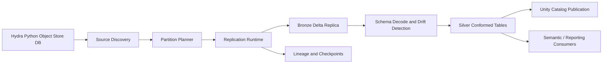

# Hydrasil Target Architecture

## Core Principle
Hydrasil should preserve source truth in bronze while creating governed, queryable Databricks silver datasets.

## Root / Trunk / Branch Metaphor
- Roots: Hydra object-store databases
- Trunk: Hydrasil replication runtime
- Sap flow: hydration into Databricks
- Branches: bronze and silver Delta datasets
- Leaves: semantic layer, reporting, analytics, and AI consumers
